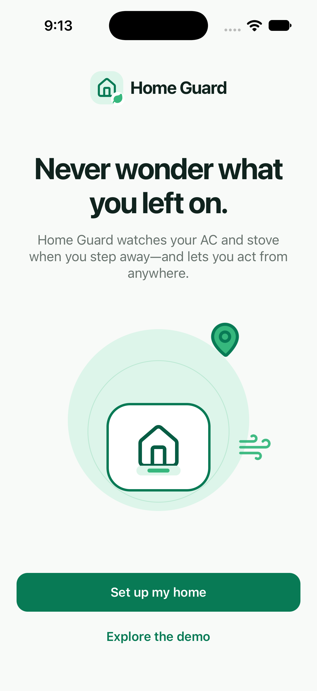
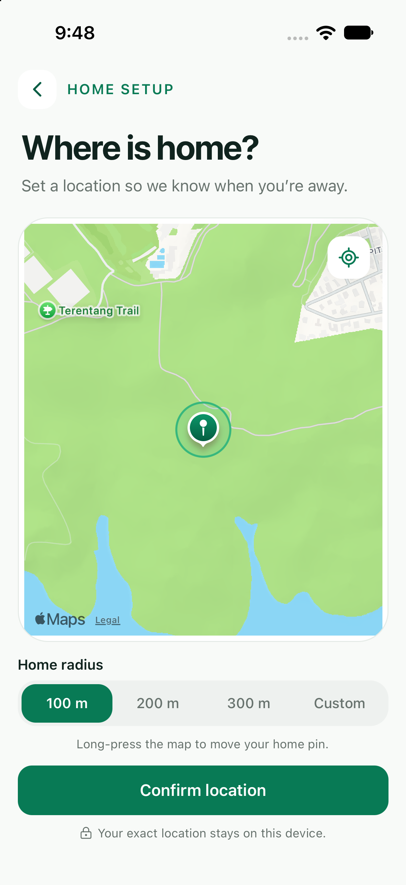
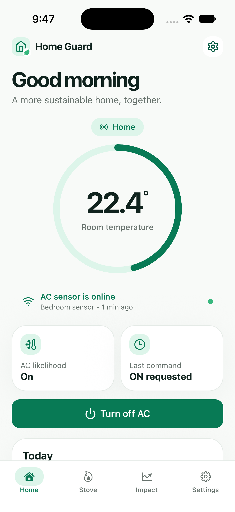
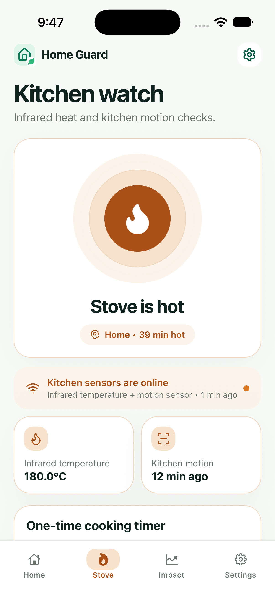
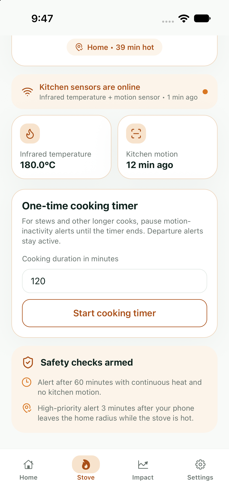
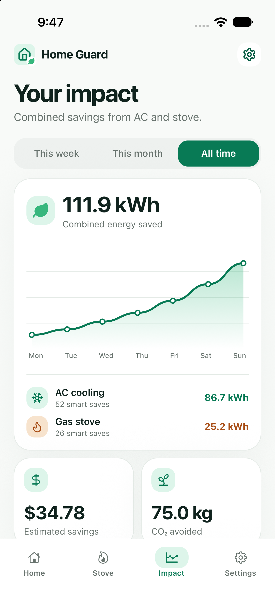
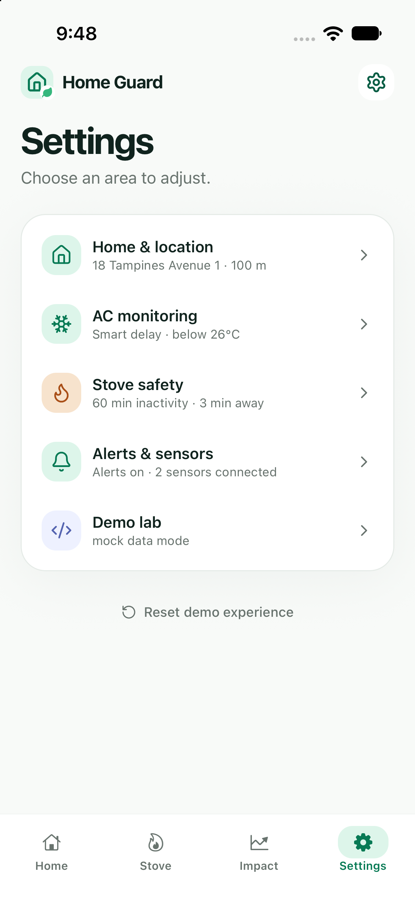
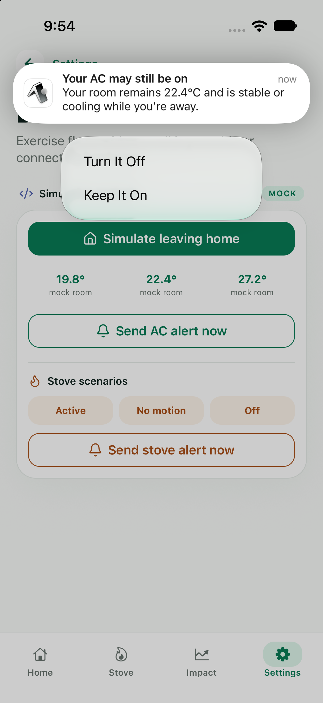
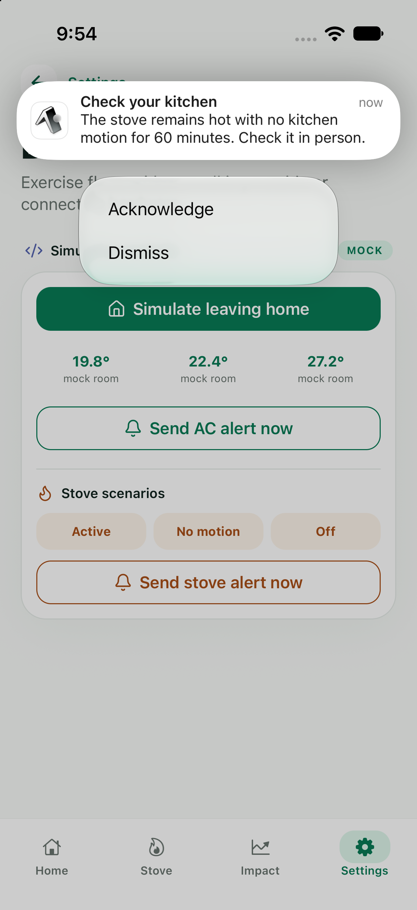

# Home Guard

Home Guard is an iOS-first Expo app that watches a home geofence, checks connected appliance sensors, and supports remote AC control and warning-only stove alerts. It includes a complete mock mode, so the onboarding, dashboards, charts, commands, and notification flow can be demonstrated without hardware or a Firebase project.

**Gallery** &nbsp;·&nbsp; [Run / replicate](docs/RUN.md)

## Gallery

| Home | Home geofence |
| --- | --- |
|  Set up a home step by step or explore the app with seeded demo data. |  Long-press the map to place the home pin, choose a radius, and confirm the geofence. |

| Home dashboard | Kitchen watch |
| --- | --- |
|  Check presence, room temperature, sensor recency, and likely AC status, then turn the AC off remotely. |  See the stove's heat state, infrared temperature, and the most recent kitchen motion reading. |

| Cooking timer and safety checks | Environmental impact |
| --- | --- |
|  Start a one-time timer for a longer cook while keeping departure alerts active. |  Switch between time ranges to review energy, cost, and carbon savings from AC and stove interventions. |

| Settings |
| --- |
|  Open grouped controls for location, AC monitoring, stove safety, sensors, alerts, and demo tools. |

| Actionable AC alert | Stove safety alert |
| --- | --- |
|  Turn the AC off from the notification or keep it running without opening the app. |  Check the kitchen in person, then acknowledge the warning or dismiss the notification. |
